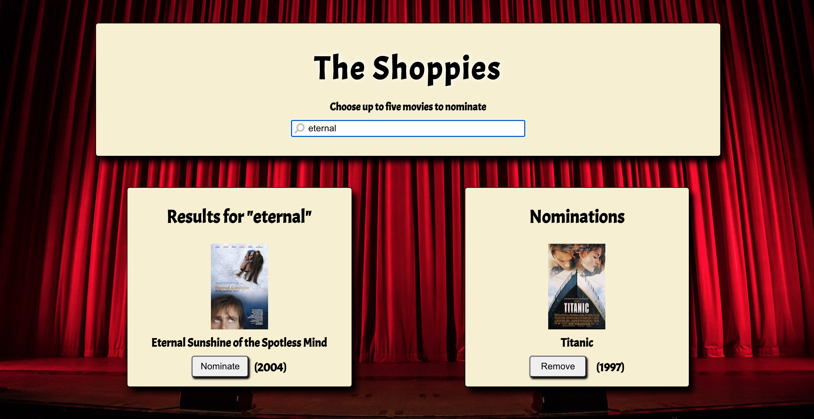

# The Shoppies - Movie Awards for Entrepreneurs

## Description
The application allows Shopify employees to nominated five movies for an award show called The Shoppies. The employee searches for a movie (powered by [OMDB's api](http://www.omdbapi.com)), clicks the nominate button, repeats this process four more times until a banner appears congratulating them on their nominations. A user can also remove a nomination. Here is [a link to the deployed site](https://shoppies-cyan.vercel.app/).

## Tech Stack
### React JS
* Declarative
* Component Based
* Renders proper Html using JSX
* Lightweight and has a very small API surface

### Redux 
* Predictable
* Centralized
* Debuggable
* Flexible

### Sass
* Used for styling

### React-Modal
* Used for working with modal components in ReactJS

### Howler
* Used for working with audio files in Javascript